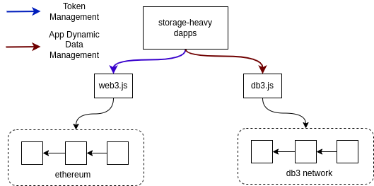

# db3.js-DB3 Network Javascript API

[](https://www.npmjs.com/package/db3.js)

[](https://www.gitpoap.io/gh/dbpunk-labs/db3.js)


db3.js is the [db3 network](https://github.com/dbpunk-labs/db3) javascript API and you can write and query JSON documents against the db3 network with db3.js.
and you can combine the [web3.js](https://github.com/web3/web3.js) and db3.js to build a fully decentralized storage-heavy application



# How to use db3.js

The goal of db3.js is compatible with [the indexeddb api](https://www.w3.org/TR/IndexedDB/) and you can use db3.js like using indexeddb, even you can use all libraries based on indexeddb e.g. [rxdb](https://github.com/pubkey/rxdb). 

## Show Your Support
Please ⭐️ this repository if this project helped you!

## Using db3.js like using the indexeddb API

```javascript
request.onsuccess = function () {
  console.log("Database opened successfully");
  const db = request.result;
  // 1
  const transaction = db.transaction("cars", "readwrite");
  //2
  const store = transaction.objectStore("cars");
  const colourIndex = store.index("cars_colour");
  const makeModelIndex = store.index("colour_and_make");
  //3
  store.put({ id: 1, colour: "Red", make: "Toyota" });
  store.put({ id: 2, colour: "Red", make: "Kia" });
  store.put({ id: 3, colour: "Blue", make: "Honda" });
  store.put({ id: 4, colour: "Silver", make: "Subaru" });
  //4
  const idQuery = store.get(4);
  const colourQuery = colourIndex.getAll(["Red"]);
  const colourMakeQuery = makeModelIndex.get(["Blue", "Honda"]);
  // 5
  idQuery.onsuccess = function () {
    console.log('idQuery', idQuery.result);
  };
  colourQuery.onsuccess = function () {
    console.log('colourQuery', colourQuery.result);
  };
  colourMakeQuery.onsuccess = function () {
    console.log('colourMakeQuery', colourMakeQuery.result);
  };
  // 6
  transaction.oncomplete = function () {
    db.close();
  };
};
```
the example from https://github.com/alexeagleson/template-indexeddb

# Build

## Run Localnet

```
cd tools && bash start_localnet.sh
```

## Run Testcase

```shell
git submodule update
# install the dependency
yarn
# generate the protobuf
make
# run test
yarn test
# format the code
yarn prettier --write src
# run benchmark
yarn benny-sdk
```
